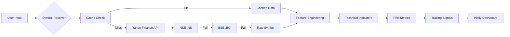

<div align="center">

# ProStock Analytics

### 📈 Professional-Grade Financial Dashboard & Technical Analysis Platform

<!-- Badges -->


---

### **Real-Time Market Analysis • Advanced Technical Indicators • Risk Metrics**

---

</div>

## 📋 Overview

**ProStock Analytics** is a professional financial dashboard that provides real-time technical analysis, comprehensive risk metrics, and market intelligence for stocks across global exchanges (NSE, BSE, NYSE, NASDAQ). Built with Python, Dash, and Plotly, it delivers institutional-grade analytics in an intuitive, dark-themed interface.

```ascii
┌───────────────────────────────────────────────────────────┐
│  ProStock Analytics Pipeline                              │
├───────────────────────────────────────────────────────────┤
│                                                           │
│  User Input  →  Data Fetch  →  Technical Analysis         │
│      ↓              ↓               ↓                     │
│   Ticker      Yahoo Finance    20+ Indicators             │
│   Symbol      Auto-Fallback    Risk Metrics               │
│                                                           │
└───────────────────────────────────────────────────────────┘
```

> 📊 **Market Intelligence**: Empowering traders and analysts with institutional-grade tools for data-driven decision making.

---

## ✨ Features

<table>
<tr>
<td width="50%">

### 📊 **Technical Analysis**

- **20+ Technical Indicators**  
  RSI, MACD, Bollinger Bands, Stochastic, CCI, MFI, ATR

- **Multi-Timeframe Charts**  
  Interactive candlestick charts with volume analysis

- **Smart Signal Detection**  
  Automated trading signals for crossovers and breakouts

- **Moving Averages**  
  SMA, EMA with golden/death cross identification

</td>
<td width="50%">

### 🎯 **Advanced Features**

- **Risk Analytics Dashboard**  
  Sharpe Ratio, Sortino Ratio, VaR, Maximum Drawdown

- **Intelligent Caching**  
  1-hour cache system for optimal performance

- **Multi-Exchange Support**  
  NSE, BSE, NYSE, NASDAQ with auto-detection

- **Auto-Fallback Mechanism**  
  Seamless switching between exchanges for Indian stocks

</td>
</tr>
</table>

---

## 🏗️ Architecture

```
┌───────────────────────────────────────────────────────────┐
│                    ProStock Core                          │
├───────────────────────────────────────────────────────────┤
│                                                           │
│  ┌──────────┐      ┌──────────┐      ┌──────────┐         │
│  │  User    │  →   │  Symbol  │  →   │  Cache   │         │
│  │  Input   │      │ Resolver │      │  Layer   │         │
│  └──────────┘      └──────────┘      └────┬─────┘         │
│                                            ↓              │
│                                     ┌──────────┐          │
│                                     │  Yahoo   │          │
│                                     │ Finance  │          │
│                                     └────┬─────┘          │
│                                          ↓                │
│  ┌──────────┐      ┌──────────┐      ┌──────────┐         │
│  │Technical │  ←   │  Data    │  ←   │   Raw    │         │
│  │Indicators│      │Processing│      │   OHLCV  │         │
│  └────┬─────┘      └──────────┘      └──────────┘         │
│       ↓                                                   │
│  ┌──────────┐      ┌──────────┐                           │
│  │   Risk   │      │ Trading  │                           │
│  │ Metrics  │      │ Signals  │                           │
│  └────┬─────┘      └────┬─────┘                           │
│       │                 │                                 │
│       └────────┬────────┘                                 │
│                ↓                                          │
│         ┌──────────────┐                                  │
│         │  Dashboard   │                                  │
│         │  (Plotly)    │                                  │
│         └──────────────┘                                  │
│                                                           │
└───────────────────────────────────────────────────────────┘
```

### 📁 Project Structure

```
ProStock-Analytics/
├── 📄 app.py                      # Main application entry point
├── 📋 requirements.txt            # Python dependencies
├── 📄 README.md                   # Documentation
├── 📂 assets/                     # Static resources
│   ├── styles.css                 # Custom styling
│   └── logo.png                   # Brand assets
├── 📂 stock_cache/                # Cache directory (auto-generated)
│   └── *.pkl                      # Binary cache files
└── 📂 docs/                       # Research & documentation
    └── technical-analysis.pdf
```

---

## 🚀 Installation

### Prerequisites

<table>
<tr>
<td width="50%">

**System Requirements**
- Python 3.8 or higher
- pip package manager
- Internet connection

</td>
<td width="50%">

**Key Dependencies**
- Dash & Plotly
- yfinance
- pandas & NumPy
- TA-Lib (Python)

</td>
</tr>
</table>

### Quick Start

```bash
# Clone the repository
git clone https://github.com/yourusername/prostock-analytics.git

# Navigate to directory
cd prostock-analytics

# Install dependencies
pip install -r requirements.txt

# Run the application
python app.py
```

### Access the Dashboard

Open your browser and navigate to:
```
http://127.0.0.1:8050
```

---

## 💻 Usage

### Basic Usage

1. **Enter a stock ticker** in the search box (e.g., `RELIANCE`, `AAPL`, `TSLA`)
2. **Click Analyze** or use quick-access buttons
3. **Explore the dashboard** with interactive charts and metrics

### Supported Exchanges

<table>
<thead>
<tr>
<th width="25%">Exchange</th>
<th width="25%">Suffix</th>
<th width="50%">Examples</th>
</tr>
</thead>
<tbody>
<tr>
<td><strong>NSE (India)</strong></td>
<td><code>.NS</code></td>
<td>RELIANCE.NS, TCS.NS, INFY.NS</td>
</tr>
<tr>
<td><strong>BSE (India)</strong></td>
<td><code>.BO</code></td>
<td>RELIANCE.BO, TCS.BO, INFY.BO</td>
</tr>
<tr>
<td><strong>NYSE/NASDAQ</strong></td>
<td>None</td>
<td>AAPL, MSFT, GOOGL, TSLA</td>
</tr>
</tbody>
</table>

### Auto-Detection

The system intelligently detects Indian stocks and automatically:
- Appends `.NS` for NSE data
- Falls back to `.BO` (BSE) if NSE fails
- Handles US stocks without suffix

---

## 📊 Technical Indicators

### Trend Indicators
- **Moving Averages**: SMA20, SMA50, EMA
- **MACD**: Moving Average Convergence Divergence with signal line

### Momentum Indicators
- **RSI**: Relative Strength Index (14-period)
- **Stochastic Oscillator**: %K and %D lines
- **CCI**: Commodity Channel Index

### Volatility Indicators
- **Bollinger Bands**: 20-period with 2 standard deviations
- **ATR**: Average True Range

### Volume Indicators
- **OBV**: On-Balance Volume
- **MFI**: Money Flow Index

---

## 🎯 Risk Analytics

The platform calculates comprehensive risk metrics:

<table>
<thead>
<tr>
<th width="30%">Metric</th>
<th width="70%">Description</th>
</tr>
</thead>
<tbody>
<tr>
<td><strong>Sharpe Ratio</strong></td>
<td>Risk-adjusted return (annualized)</td>
</tr>
<tr>
<td><strong>Sortino Ratio</strong></td>
<td>Downside risk-adjusted return</td>
</tr>
<tr>
<td><strong>Maximum Drawdown</strong></td>
<td>Largest peak-to-trough decline</td>
</tr>
<tr>
<td><strong>Value at Risk</strong></td>
<td>95% confidence level potential loss</td>
</tr>
<tr>
<td><strong>Win Rate</strong></td>
<td>Percentage of positive trading days</td>
</tr>
</tbody>
</table>

---

## 🔄 Data Flow



---

## 🚀 Future Roadmap

- **Portfolio Optimization**: Multi-asset portfolio tracking and optimization
- **Machine Learning**: LSTM/Transformer models for price forecasting
- **User Accounts**: Persistent preferences and watchlists
- **Alert System**: Price and indicator-based notifications
- **Backtesting Engine**: Strategy performance testing

---

## 🤝 Contributing

Contributions are welcome! Here's how you can help:

1. **Fork** the repository
2. **Create** a feature branch (`git checkout -b feature/amazing-feature`)
3. **Commit** your changes (`git commit -m 'Add amazing feature'`)
4. **Push** to the branch (`git push origin feature/amazing-feature`)
5. **Open** a Pull Request

---

## 📜 License

This project is licensed under the **MIT License** - see the LICENSE file for details.

---

## 📞 Contact

<div align="center">

[](https://github.com/DivyanshuSaini2112)
[](https://www.linkedin.com/in/divyanshu-saini2112)

---

### 📈 Trade Smart, Trade Safe! 📈

*Built with ❤️ for traders and analysts*

</div>
